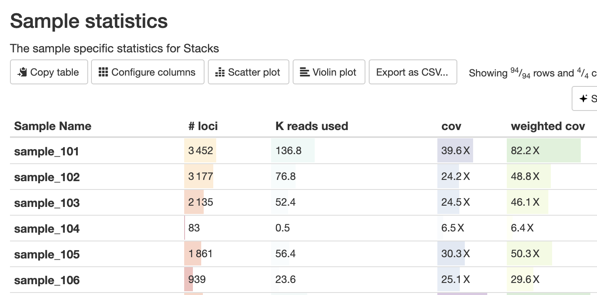
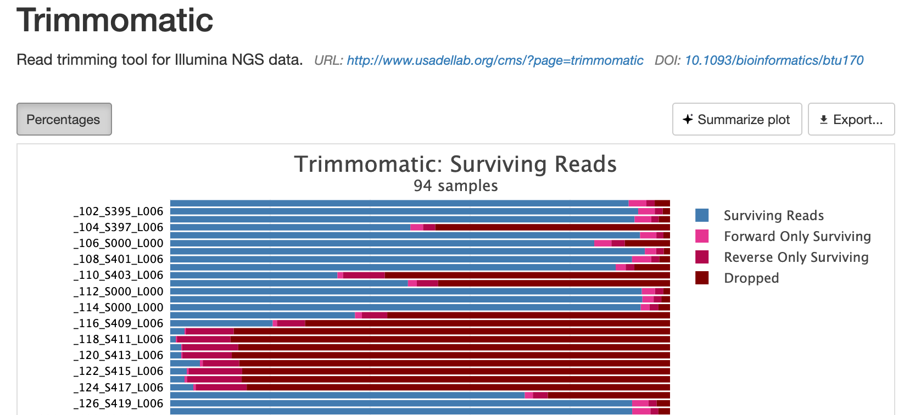
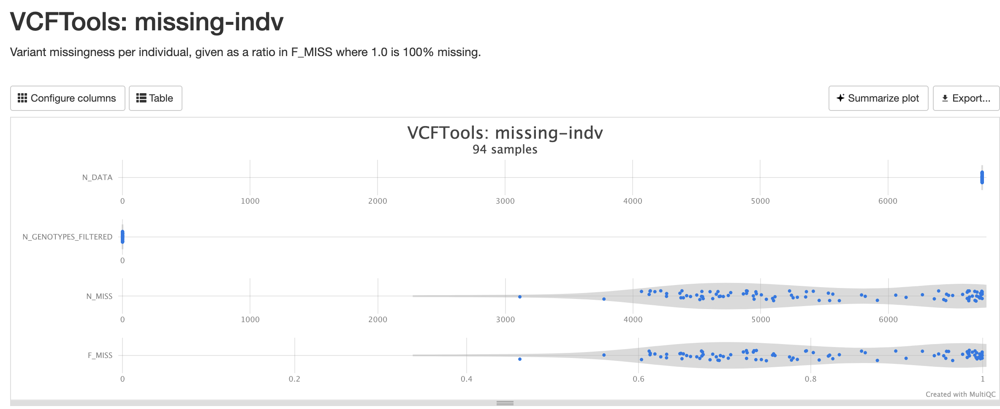

# remiolsen/radqc: Output

## Introduction

This document describes the output produced by the pipeline. Most of the plots are taken from the MultiQC report, which summarises results at the end of the pipeline.

The directories listed below will be created in the results directory after the pipeline has finished. All paths are relative to the top-level results directory.

## Pipeline overview

The pipeline is built using [Nextflow](https://www.nextflow.io/) and processes data using the following steps:

- [MultiQC](#multiqc) - Aggregate report describing results and QC from the whole pipeline
- [Trimmomatic](#trimmomatic) - Quality and adapter trimming of sequencing reads
- [FastQC](#fastqc) - Quality control metrics for sequencing reads
- [Stacks process_radtags](#stacks-process_radtags) - Demultiplexing and cleaning of RAD-seq data
- [Stacks denovo_map](#stacks-denovo_map) - De novo assembly and genotyping of RAD-seq data
- [VCFtools](#vcftools) - Analysis and filtering of VCF filesx
- [Pipeline information](#pipeline-information) - Report metrics generated during the workflow execution

### MultiQC

Output files

- `multiqc/`
  - `multiqc_report.html`: a standalone HTML file that can be viewed in your web browser.
  - `multiqc_data/`: directory containing parsed statistics from the different tools used in the pipeline.
  - `multiqc_plots/`: directory containing static images from the report in various formats.

[MultiQC](http://multiqc.info) is a visualization tool that generates a single HTML report summarising all samples in your project. Most of the pipeline QC results are visualised in the report and further statistics are available in the report data directory.

Results generated by MultiQC collate pipeline QC from supported tools e.g. FastQC. The pipeline has special steps which also allow the software versions to be reported in the MultiQC output for future traceability. For more information about how to use MultiQC reports, see <http://multiqc.info>.

>**Figure 1**: Number of assembled loci (stacks) generated by Stacks. This show for instance that "sample_104" received an extremely
>low coverage (6.5X), "sample_105" sufficient coverage (30.3X) and "sample_106" borderline coverage (25.1X).

>**Figure 2**: Overview of read survival rates after running trimmomatic. Low survival rate (e.g sample "_118_S411") is typically >caused by high adaptor content or low quality sequencing runs.

>**Figure 3**: The fraction of Stacks variants missing in each sample (F_MISS), where lower is better. This value is usually >inversely correlated with sequencing depth, but can be an indicate issues with the rad-seq experiment.

### Trimmomatic

Output files

- `trimmomatic/`
  - `*.paired.trim_{1,2}.fastq.gz`: Quality and adapter trimmed reads
  - `*.summary`: Summary of read survival rates after trimming

[Trimmomatic](http://www.usadellab.org/cms/?page=trimmomatic) is a widely-used tool for preprocessing high-throughput sequencing data, focusing on tasks like adapter removal and quality trimming to enhance read quality. 

### FastQC

Output files

- `fastqc/`
  - `*_fastqc.html`: FastQC report containing quality metrics.
  - `*_fastqc.zip`: Zip archive containing the FastQC report, tab-delimited data file and plot images.

[FastQC](http://www.bioinformatics.babraham.ac.uk/projects/fastqc/) gives general quality metrics about your sequenced reads. It provides information about the quality score distribution across your reads, per base sequence content (%A/T/G/C), adapter contamination and overrepresented sequences. For further reading and documentation see the [FastQC help pages](http://www.bioinformatics.babraham.ac.uk/projects/fastqc/Help/).

### Stacks process_radtags

Output files

- `process_radtags/`
  - `*.{1,2}.fq.gz`: Processed reads output by Stacks
  - `*.process_radtags.log`: A summary of read counts removed by the various filters

[Stacks process_radtags](https://catchenlab.life.illinois.edu/stacks/comp/process_radtags.php) is a command from the Stacks software suite, developed by the Catchen lab. The `process_radtags` command is designed to demultiplex and clean raw sequencing data generated from RAD-seq experiments. It performs tasks such as quality filtering, adapter removal, and barcode demultiplexing.

### Stacks denovo_map

Output files (summary)

- `denovo_stacks/`
  - `*.{tags,snps,alleles}.tsv.gz`: Per sample based loci and allele calls (ustacks)
  - `catalog.{tags,snps,alleles}.tsv.gz`: A catalog or a set of consensus loci, snps and alleles (cstacks)
  - `*.matches.bam`: Per sample matches to the catalog (sstacks + tsv2bam)
  - `populations.snps.vcf`: Polymorphic sites in VCF format (populations)
  - `denovo_map.log`: Running log file for the whole denovo_map.pl pipeline

[Stacks denovo_map.pl](https://catchenlab.life.illinois.edu/stacks/comp/denovo_map.php) pipeline developed by the Catchen lab. The pipeline is designed for de novo assembly and genotyping of RAD-seq data, enabling the identification of loci and genetic variants without the need for a reference genome.
It processes raw sequencing reads, clusters them into loci, and performs SNP calling and genotyping across multiple samples. The script automates the execution of various Stacks modules, including `ustacks`, `cstacks`, `sstacks`, and `populations`.

### VCFtools

Output files

- `vcftools/`
  - `stacks_denovo_map.het`: Heterozygosity per individual, inbreeding coefficient F
  - `stacks_denovo_map.idepth`: Mean sequence depth per individual
  - `stacks_denovo_map.imiss`: Variant missingness per individual
  - `stacks_denovo_map.relatedness2`: Relatedness statistic (based on doi:10.1093/bioinformatics/btq559)

[VCFtools](https://vcftools.github.io/) is a software suite for working with VCF files, a standard format for storing genetic variation data. It provides tools for filtering, summarizing, and analyzing variant data, enabling researchers to perform population genetics analyses and quality control.

### Pipeline information

Output files

- `pipeline_info/`
  - Reports generated by Nextflow: `execution_report.html`, `execution_timeline.html`, `execution_trace.txt` and `pipeline_dag.dot`/`pipeline_dag.svg`.
  - Reports generated by the pipeline: `pipeline_report.html`, `pipeline_report.txt` and `software_versions.yml`. The `pipeline_report*` files will only be present if the `--email` / `--email_on_fail` parameter's are used when running the pipeline.
  - Reformatted samplesheet files used as input to the pipeline: `samplesheet.valid.csv`.
  - Parameters used by the pipeline run: `params.json`.

[Nextflow](https://www.nextflow.io/docs/latest/tracing.html) provides excellent functionality for generating various reports relevant to the running and execution of the pipeline. This will allow you to troubleshoot errors with the running of the pipeline, and also provide you with other information such as launch commands, run times and resource usage.
